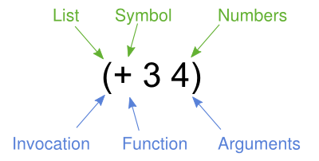

# ClojureStudy
## require 关键字

`require` 可以导入依赖包：

```clojure
(require '[clojure.string])
(clojure.string/upper-case "clojure") ;; 
```

调用包 `clojure.string` 的 `upper-case` 方法。

require 可以重命名方法：

```clojure
(require '[clojure.string :as str])
(str/upper-case "clojure")
```

这样就不用写完整的包名。

还有更简单的，通过 require + refer 导入并申明：

```clojure
(require '[clojure.string :refer [upper-case]])
(upper-case "clojure")
```

## doc 查看文档

可以通过评估 (`doc MY-VAR-NAME`)来打印给定 Var 的 API 文档：

```clojure
user=> (doc nil?)
-------------------------
clojure.core/nil?
([x])
  Returns true if x is nil, false otherwise.
nil
user=> (doc clojure.string/upper-case)
-------------------------
clojure.string/upper-case
([s])
  Converts string to all upper-case.
nil
```

## source 查看源码

您还可以使用 `source` 查看用于定义 Var 的源代码：

```clojure
(source some?)
(defn some?
  "Returns true if x is not nil, false otherwise."
  {:tag Boolean
   :added "1.6"
   :static true}
  [x] (not (nil? x)))
nil
```

## dir 列出包命名空间中所有 Vars 名称

```clojure
(dir clojure.string)
blank?
capitalize
ends-with?
escape
includes?
index-of
join
...
```

## aprops

如果你不太记得某个 Var 的名字，可以使用 apropos 进行搜索：

```clojure
(apropos "index")
(clojure.core/indexed? clojure.core/keep-indexed clojure.core/map-indexed clojure.string/index-of clojure.string/last-index-of)
```

## find-doc

查询文档内容：

```clojure
(find-doc "indexed")
```

## 语法

### 符号和标识符

```clojure
map ;符号  
+ ;符号 - 允许使用大多数标点符号  
clojure.core/+ ;带命名空间的符号  
nil ;空值  
true false ;布尔值  
:alpha ;关键字  
:release/alpha ;带命名空间的关键字  
```

符号由字母、数字和其他标点组成，用于引用其他事物，比如函数、值、命名空间等。符号可以选择性地带有命名空间，与名称之间用斜杠分隔。

有三个特殊的符号被视为不同的类型：`nil` 表示空值，`true` 和 `false` 表示布尔值。

关键字以冒号开头，并且始终自我求值。它们在 Clojure 中常用于枚举值或属性名称。

### 字面量集合

Clojure 还为四种集合类型提供了字面量语法：

```clojure
'(1 2 3) ;列表 
[1 2 3] ;向量 
#{1 2 3} ;集合
{:a 1, :b 2} ;映射  
```

我们稍后会详细讨论这些内容——目前你只需知道这四种数据结构可用于创建复合数据。

### Clojure 求值

在 Clojure 中，源代码由读取器（Reader）作为字符读取。读取器可以从 `.clj` 文件读取源代码，也可以交互式地接收一系列表达式。读取器输出 Clojure 数据，而 Clojure 编译器则将这些数据转化为 JVM 的字节码。

这里有两个关键点：

1. 源代码的基本单位是 **Clojure 表达式**，而不是 Clojure 源文件。源文件会被读取为一系列表达式，就像在 REPL 中交互式输入这些表达式一样。

2. 将读取器和编译器分离是一个重要的设计，使宏有了发挥空间。宏是特殊的函数，它们接收代码（作为数据）并输出代码（作为数据）。你是否能看到在评估模型中可以插入一个用于宏展开的循环位置？

#### 结构与语义

考虑以下 Clojure 表达式：



此图展示了语法（绿色，表示读取器生成的 Clojure 数据结构）和语义（蓝色，表示 Clojure 运行时对数据的理解）之间的区别。

大多数字面量的 Clojure 形式会自我求值，除了符号和列表。符号用于引用其他内容，在求值时返回它们所引用的对象。列表（如图所示）被求值为调用操作。

在图中，`(+ 3 4)` 被读取为一个包含符号 `+` 和两个数字 `3` 和 `4` 的列表。列表的第一个元素（即 `+` 的位置）称为“函数位置”，用于找到要调用的对象。尽管函数是最明显的调用对象，Clojure 运行时还识别一些特殊操作符、宏以及少量其他可调用对象。

考虑上述表达式的求值过程：

- `3` 和 `4` 自我求值为长整型数字（`long`）
- `+` 求值为实现加法的函数
- 求值列表将调用 `+` 函数，并以 `3` 和 `4` 作为参数

许多编程语言同时拥有语句和表达式，其中语句具有某些状态变化的效果，但不返回值。在 Clojure 中，一切都是表达式，并且都会求值为某个值。某些表达式（但并非大多数）也具有副作用。

现在，让我们考虑一下如何在 Clojure 中交互式地求值表达式。

#### 使用单引用延迟求值

有时，延迟求值是有用的，特别是对符号和列表而言。有些情况下，符号仅仅应该作为符号，而不去查找其引用的内容：

```clojure
user=> 'x
x
```

有时，列表也仅仅是一个数据值的列表（而不是需要求值的代码）：

```clojure
user=> '(1 2 3)
(1 2 3)
```

一个常见的错误是意外地将数据列表当作代码求值：

```clojure
user=> (1 2 3)
Execution error (ClassCastException) at user/eval156 (REPL:1).
class java.lang.Long cannot be cast to class clojure.lang.IFn
```

暂时不必过于担心引用（`quote`），但在这些内容中，你会偶尔看到它用于避免对符号或列表的求值。

```
user=>(+ 3 4)
7
user=>(+ 10 *1)
17
user=>(+ *1 *2)
24
```

- `*1`：最后一个结果。
- `*2`：两个表达式前的结果。
- `*3`：三个表达式前的结果。

### Clojure 基础

#### def

当你在 REPL 中求值时，保存一些数据以供后用是很有用的。我们可以使用 `def` 来实现：

```clojure
user=> (def x 7)
#'user/x
```

`def` 是一种特殊形式，它在当前命名空间中将符号（`x`）与一个值（`7`）关联起来。这种关联称为“变量”（var）。在实际的 Clojure 代码中，变量通常应该引用一个常量值或一个函数，但在 REPL 中为了方便，通常会反复定义和重新定义它们。

注意上面的返回值是 `#'user/x`——这是一个变量的字面表示：`#'` 后跟带命名空间的符号。`user` 是默认的命名空间。

记住，符号通过查找它们所引用的内容来求值，因此我们只需使用该符号即可取回它的值：

```clojure
user=> (+ x x)
14
```

#### Printing

学习一门语言时，最常做的事情之一就是打印值。Clojure 提供了几种打印值的函数：

|        | 适用于人类阅读 | 可作为数据读取 |
| ------ | -------------- | -------------- |
| 换行   | println        | prn            |
| 不换行 | print          | pr             |

适合人类阅读的形式会将特殊字符（如换行和制表符）转为其打印形式，并省略字符串中的引号。`println` 常用于调试函数或在 REPL 中打印值。`println` 可以接收任意数量的参数，并在每个参数的打印值之间加上空格：

```
user=> (println "What is this:" (+ 1 2))
What is this: 3
```

`println` 函数有副作用（打印），其返回结果为 `nil`。

注意上面 `"What is this:"` 没有打印出引号，这并不是读取器可以再次读取的数据形式。

为此，可以使用 `prn` 以数据形式打印：

```
user=> (prn "one\n\ttwo")
"one\n\ttwo"
```

此时，打印的结果是一个有效形式，读取器可以再次读取。根据上下文，你可以选择更适合人类阅读的形式或数据形式。

### 测试题

1.Using the REPL, compute the sum of 7654 and 1234.

```
user=> (+ 7654 1234)
```

2.Rewrite the following algebraic expression as a Clojure expression: ( 7 + 3 * 4 + 5 ) / 10.

```
user=>(/ (+ (+ (* 3 4) 7) 5) 10)
```

3.Using REPL documentation functions, find the documentation for the `rem` and `mod` functions. Compare the results of the provided expressions based on the documentation.

```
user=> doc rem
doc mod
```

4.Using `find-doc`, find the function that prints the stack trace of the most recent REPL exception.

```
(find-doc "stack")
```

## 函数

### 创建函数

Clojure 是一门函数式语言。函数是第一类对象，可以作为参数传递给其他函数或从其他函数返回。大多数 Clojure 代码主要由纯函数（无副作用）组成，因此相同的输入总是产生相同的输出。

`defn` 用于定义一个命名函数：

```clojure
;;    name   params         body
;;    -----  ------  -------------------
(defn greet  [name]  (str "Hello, " name) )
```

此函数只有一个参数 `name`，不过你可以在参数向量中包含任意数量的参数。

调用函数时，将函数名放在“函数位置”（列表的第一个元素）即可：

```clojure
user=> (greet "students")
"Hello, students"
```

#### 多参函数

函数可以定义为接受不同数量的参数（不同“参数数量”）。不同的参数数量必须在同一个 `defn` 中定义——如果多次使用 `defn` 定义相同函数名，会覆盖前一个定义。

每种参数数量的定义格式为 `([参数*] 表达式*)`。一个参数数量的定义可以调用另一个。函数体可以包含任意数量的表达式，返回值是最后一个表达式的结果。

```
(defn messenger
  ([]     (messenger "Hello world!"))
  ([msg]  (println msg)))
```

例如，这个函数声明了两个参数数量（0个参数和1个参数）。0参数的形式会调用1参数形式，并使用一个默认值进行打印。我们通过传入相应数量的参数来调用这些函数：

```clojure
user=> (messenger)
Hello world!
nil

user=> (messenger "Hello class!")
Hello class!
nil
```

> 类似于 C# 中的函数重载

#### 可变参数函数

函数还可以定义为接受不定数量的参数——这称为“可变参数”函数。可变参数必须放在参数列表的末尾，并会被收集到一个序列中供函数使用。

可变参数的起始由 `&` 标记。

```clojure
(defn hello [greeting & who]
  (println greeting who))
```

例如，此函数接收一个参数 `greeting` 和不定数量的参数（0个或更多），这些可变参数将被收集到名为 `who` 的列表中。我们可以通过传入三个参数来调用它：

```clojure
user=> (hello "Hello" "world" "class")
Hello (world class)
```

可以看到，当 `println` 打印 `who` 时，它被打印为一个包含两个元素的列表。

#### 匿名函数

匿名函数可以通过 `fn` 创建：

```clojure
;;    params         body
;;   ---------  -----------------
(fn  [message]  (println message) )
```

由于匿名函数没有名称，因此无法在以后引用它。通常，匿名函数会在将其传递给另一个函数时创建。

也可以立即调用它（这种用法不常见）：

```clojure
;;     operation (function)             argument
;; --------------------------------  --------------
(  (fn [message] (println message))  "Hello world!" )

;; Hello world!
```

在这里，我们将匿名函数定义在一个更大表达式的函数位置，并直接用参数调用它。

在许多编程语言中，语句用于执行操作但不返回值，而表达式则返回值。而在 Clojure 中，所有代码块都是表达式，都会返回一个值，即使是像 `if` 这样的流程控制语句。

##### defn vs fn

可以将 `defn` 看作是 `def` 和 `fn` 的结合体。`fn` 定义了一个函数，而 `def` 将这个函数绑定到一个名称上。以下两种写法是等效的：

```clojure
(defn greet [name] (str "Hello, " name))

(def greet (fn [name] (str "Hello, " name)))
```

#### 匿名函数语法

Clojure 读取器实现了一种更简洁的匿名函数语法：`#()`。这种语法省略了参数列表，并根据参数的位置为它们命名。

- `%` 用于单个参数
- `%1`、`%2`、`%3` 等用于多个参数
- `%&` 用于剩余的（可变）参数

由于嵌套匿名函数会导致参数命名的歧义，因此不允许嵌套使用这种语法。

```clojure
;; Equivalent to: (fn [x] (+ 6 x))
#(+ 6 %)

;; Equivalent to: (fn [x y] (+ x y))
#(+ %1 %2)

;; Equivalent to: (fn [x y & zs] (println x y zs))
#(println %1 %2 %&)
```

#### 陷阱

一个常见需求是创建一个匿名函数，它接收一个元素并将其包装到一个向量中。你可能会尝试这样写：

```clojure
;; DO NOT DO THIS
#([%])
```

这个匿名函数实际展开后等效于：

```clojure
(fn [x] ([x]))
```

> 在这里：
>
> - `([x])` 的意思是：构建一个包含 `x` 的向量，并尝试调用它。然而，在 Clojure 中，`([x])` 不是合法的写法，因为 **`([x])` 意图调用一个向量**，但向量不能作为函数被调用。
> - 因此，这种写法会导致程序出错。

这种形式会将元素包装到一个向量中，但也会尝试用一个空参数调用该向量（多出来的一对圆括号）。正确的写法是：

```clojure
;; Instead do this:
#(vector %)

;; or this:
(fn [x] [x])

;; or most simply just the vector function itself:
vector
```

